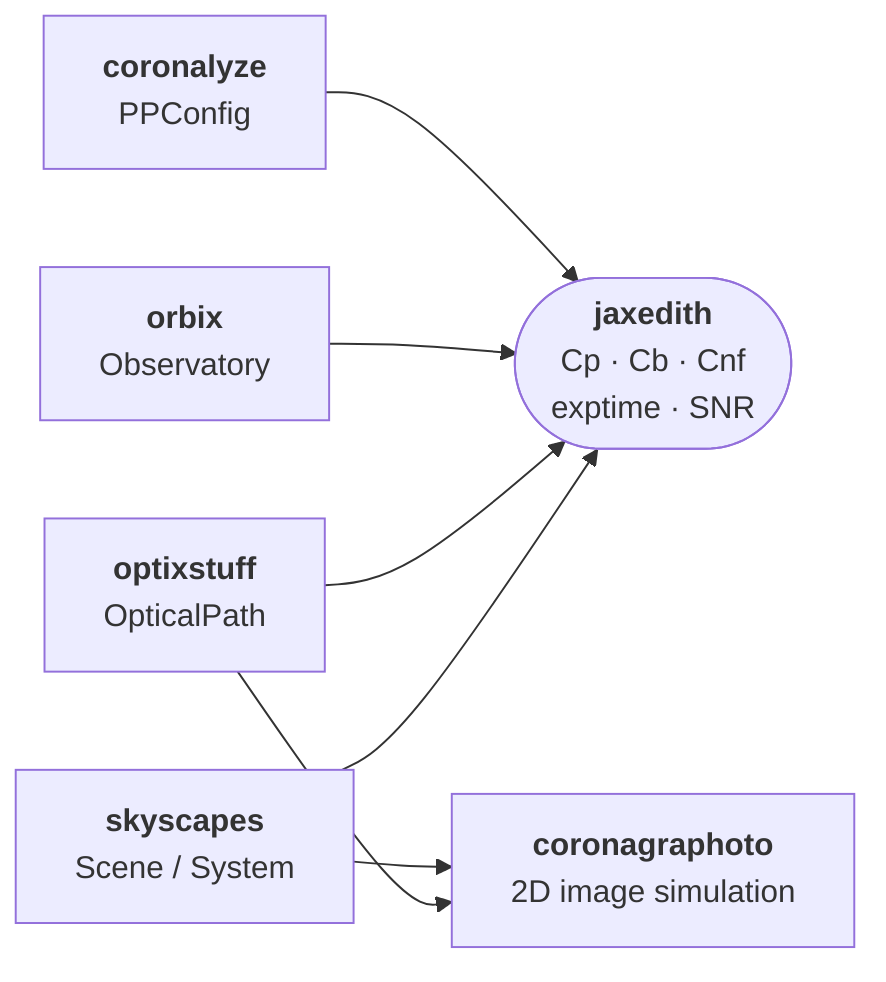

<p align="center">
  <a href="https://pypi.org/project/jaxedith/"></a>
  <a href="https://jaxedith.readthedocs.io"></a>
  <a href="https://github.com/coreyspohn/jaxedith/blob/main/LICENSE"></a>
  <a href="https://pypi.org/project/jaxedith/"></a>
</p>

# jaxedith

The JAX-native exposure-time-calculator kernel for an HWO direct-imaging
stack.

`jaxedith` returns scalar count rates, exposure times, and SNR
predictions from a coronagraph + scene + observation triple. It is the
**fast inner loop** for yield calculations, sensitivity studies, and
retrievals where the ETC has to be differentiable, `vmap`-able, and
JIT-able end-to-end.

If you want a friendly, general-purpose AYO exposure-time calculator
with a standalone Python API,
[pyEDITH](https://github.com/eleonoraalei/pyEDITH/) is the right tool.
`jaxedith` is the same AYO / pyEDITH ETC heritage rebuilt as a JAX
kernel for an HWO direct-imaging stack: it takes
[skyscapes](https://github.com/CoreySpohn/skyscapes) +
[optixstuff](https://github.com/CoreySpohn/optixstuff) +
[orbix](https://github.com/CoreySpohn/orbix) +
[coronalyze](https://github.com/CoreySpohn/coronalyze) types as
inputs, prioritises JAX fitness (JIT, vmap, grad) over ergonomics, and
is meant to be called by other stack code, not picked up standalone.
The EXOSIMS detection and characterization variants are exposed via
parallel function families.

Three properties define the design:

- **Pure JAX.** Every public function is JIT-compatible, `vmap`-able,
  and differentiable end-to-end.
- **Variant-explicit API.** Three ETC equations (AYO, EXOSIMS
  detection, EXOSIMS characterization) live in three parallel function
  families (`exptime_ayo`, `exptime_exosims_det`,
  `exptime_exosims_char`) with no runtime dispatch — JIT caches one
  trace per variant.
- **Two usage modes.**
  - *Scalar mode* (`exptime_ayo(optical_path, scene, ...)`) takes an
    `optixstuff.OpticalPath` plus an `ETCScene` dataclass of
    astrophysical scalars — useful for parameter sweeps and tests.
  - *System mode* (`exptime_from_system_ayo(system, optical_path,
    observatory, exposure, ppconfig)`) accepts a full
    `skyscapes.System` + `optixstuff.OpticalPath` +
    `orbix.observatory.Observatory` + `optixstuff.ExposureConfig` +
    `coronalyze.PPConfig`, extracts per-(planet, epoch) astrophysics,
    and `jax.vmap`s the scalar core over `(K, T)`.

## What jaxedith is *not*

- **Not an image simulator.** 2D detector images and post-processing
  live in [coronagraphoto](https://github.com/CoreySpohn/coronagraphoto)
  and [coronalyze](https://github.com/CoreySpohn/coronalyze).
  `jaxedith` predicts the integrated scalar count rates the image
  simulator's outputs would yield.
- **Not a scene model.** Scenes (`Star`, `Planet`, `Disk`, physical
  models, backgrounds) live in
  [skyscapes](https://github.com/CoreySpohn/skyscapes). `jaxedith`
  consumes them via the `_from_system_*` wrappers.
- **Not a yield simulator.** Mission-scale loops over many targets +
  visit scheduling live in dedicated yield codes (e.g. AYO,
  EXOSIMS). `jaxedith` is the per-target ETC kernel those codes can
  invoke.

## Ecosystem position



## Architecture

Four modules organized as a left-to-right pipeline:

```
primitives → intermediates → etc → public
```

| Module | Role | Signature shape |
|---|---|---|
| `jaxedith.primitives` | Scalar building blocks | `(scalars...) → rate` |
| `jaxedith.intermediates` | `OpticalPath` adapters, one per noise-budget term (signal, background, noise floor) | `(optical_path, scalars...) → rate` |
| `jaxedith.etc` | Closed-form exptime + SNR algebra | `(rates, snr or t_obs, ...) → exptime or snr` |
| `jaxedith.public` | Variant-explicit user entry points + system wrappers | `(optical_path, scene, ...) → exptime or snr` |

Each layer composes the previous; the module name tells you the role
at that level of abstraction. Most users only call `public.*`; the
lower layers are exposed for advanced use (testing, custom budgets,
sensitivity studies).

## Variants

Three ETC equations, each with three entry-point flavours (count
rates, exposure time, SNR):

| Variant | Origin | Background multiplier | Noise floor |
|---|---|---|---|
| `ayo` | AYO / pyEDITH | 2× (ADI assumption) | analytical `Cnf_rate = raw_contrast × ppfact` |
| `exosims_det` | EXOSIMS detection | 1× | speckle residual `Csp` |
| `exosims_char` | EXOSIMS characterization | 1× + `Cp` self-noise | speckle residual `Csp` |

Pick the variant that matches your reference convention; no runtime
dispatch.

## Quick start

Scalar mode (you've got the astrophysical scalars in hand):

```python
from jaxedith import ETCScene, exptime_ayo
import optixstuff as ox

# Build the hardware
optical_path = ox.OpticalPath(...)

# Build the scene (8 dimensionless scalars + 2 geometric)
scene = ETCScene(
    F0=1.34e8,           # flux zero point [ph/s/m^2/nm]
    Fs_over_F0=0.005,    # stellar / zeropoint
    Fp_over_Fs=1e-10,    # planet-star contrast
    Fzodi=3.5e-10,       # local zodi surface brightness ratio
    Fexozodi=7.15e-9,    # exozodi at 1 AU
    dist_pc=10.0,
    sep_arcsec=0.1,
    Fbinary=0.0,
)

t_exp = exptime_ayo(
    optical_path, scene,
    wavelength_nm=500.0, separation_lod=5.0,
    dlambda_nm=100.0, snr=7.0,
)
```

System mode (you have a `skyscapes.System`):

```python
import jax.numpy as jnp
import optixstuff as ox
from coronalyze import PPConfig
from jaxedith import exptime_from_system_ayo, zodi_fn_ayo
from orbix.observatory import Observatory, ObservatoryL2Halo

t_exp = exptime_from_system_ayo(
    system,
    optical_path,
    observatory=Observatory(orbit=ObservatoryL2Halo.from_default()),
    exposure=ox.ExposureConfig(
        start_time_jd=jnp.array([2_460_000.5]),
        exposure_time_s=jnp.asarray(3600.0),
        central_wavelength_nm=jnp.asarray(500.0),
        bin_width_nm=jnp.asarray(20.0),
        position_angle_deg=jnp.asarray(0.0),
    ),
    ppconfig=PPConfig(ppfact=1.0, n_rolls=1, ez_ppf=jnp.inf),
    snr=7.0,
    zodi_fn=zodi_fn_ayo,
)
# t_exp shape (K, T): one exptime per (planet, epoch)
```

## Installation

```bash
pip install jaxedith
```

For GPU acceleration, install JAX with a CUDA build separately (see
the [JAX install guide](https://docs.jax.dev/en/latest/installation.html)).

## Status

Early development. The public API was consolidated in May 2026 as
part of a workspace-wide v1.0 cycle; breaking changes will be flagged
via release-please major-bump tags.
