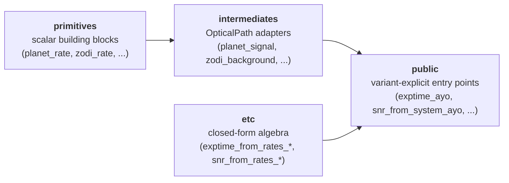

# Architecture

jaxedith is organized as a left-to-right pipeline of four modules.
Each layer composes the previous; the module name tells you the
abstraction level.

```
primitives → intermediates → etc → public
```



Most users only call `public.*`. The lower layers are exposed for
advanced use (testing, custom budgets, partial-noise traces).

## Layer 1: `primitives`

Scalar building blocks. Each function takes pure-float physical
inputs and returns a count rate or a derived scalar. No
`OpticalPath` knowledge.

```python
from jaxedith.primitives import (
    planet_rate, stellar_leakage_rate,
    zodi_rate, exozodi_rate, binary_rate,
    thermal_rate, detector_noise_rate,
    noise_floor_stellar, noise_floor_exozodi,
    speckle_residual, photon_counting_time,
)

Cp = planet_rate(
    F0=1.34e8, Fs_over_F0=0.005, Fp_over_Fs=1e-10,
    area_m2=42.76, throughput=0.36, core_throughput=0.30,
    dlambda_nm=100.0, n_channels=2,
)
```

**Signature shape:** `(scalars...) → rate`. Inputs are raw floats in
consistent units; no astropy units, no side effects. Every primitive
is pure JAX and JIT-compatible.

## Layer 2: `intermediates`

Adapter functions that take an {class}`optixstuff.OpticalPath` + a
small set of scalars, unpack the optical path, and call the
corresponding Layer 1 primitive. There is one intermediate per
noise-budget term (signal, background, noise floor).

```python
from jaxedith.intermediates import (
    planet_signal, stellar_leakage,
    zodi_background, exozodi_background, binary_background,
    thermal_background, detector_noise, stellar_noise_floor,
)

Cp = planet_signal(
    optical_path,
    wavelength_nm=500.0, separation_lod=5.0, dlambda_nm=100.0,
    F0=1.34e8, Fs_over_F0=0.005, Fp_over_Fs=1e-10,
    n_channels=optical_path.n_channels,
)
```

**Signature shape:** `(optical_path, scalars...) → rate`. The
intermediate layer is the right level to drop in if you want
per-term control without the variant orchestrator.

## Layer 3: `etc`

Closed-form ETC equations. Six functions: three exptime-solve and
three snr-solve, one pair per variant (AYO, EXOSIMS-detection,
EXOSIMS-characterization). Each accepts count *rates* (no SNR baked
in) and returns either an exposure time or an achieved SNR.

```python
from jaxedith.etc import (
    exptime_from_rates_ayo, snr_from_rates_ayo,
    exptime_from_rates_exosims_det, snr_from_rates_exosims_det,
    exptime_from_rates_exosims_char, snr_from_rates_exosims_char,
)

t_exp = exptime_from_rates_ayo(Cp, Cb, Cnf_rate, snr=7.0)
snr = snr_from_rates_ayo(Cp, Cb, Cnf_rate, t_obs=3600.0)
```

**Signature shape:** `(rates, snr_or_t_obs, ...) → exptime or snr`.
The `_from_rates_` suffix marks this module as closed-form math; the
rate triple `(Cp, Cb, Cnf_rate)` for AYO or `(Cp, Cb, Csp)` for
EXOSIMS is computed upstream in `intermediates` + `public`.

## Layer 4: `public`

Variant-explicit user entry points. Each entry point comes in a
scalar flavour and a system-wrapped flavour:

```python
# Scalar mode -- pass an ETCScene of astrophysical scalars
from jaxedith import (
    count_rates_ayo, exptime_ayo, snr_ayo,
    count_rates_exosims_det, exptime_exosims_det, snr_exosims_det,
    count_rates_exosims_char, exptime_exosims_char, snr_exosims_char,
)

# System mode -- pass a skyscapes.System; vmap'd over (K planets, T epochs)
from jaxedith import (
    count_rates_from_system_ayo, exptime_from_system_ayo, snr_from_system_ayo,
    count_rates_from_system_exosims_det, exptime_from_system_exosims_det,
    snr_from_system_exosims_det,
    count_rates_from_system_exosims_char, exptime_from_system_exosims_char,
    snr_from_system_exosims_char,
)
```

**Signature shape (scalar):** `(optical_path, scene, scalars...) →
scalar`.
**Signature shape (system):** `(system, optical_path, observatory,
exposure, ppconfig, ...) → array(K, T)`.

The system wrappers share a thin internal `_extract_per_kt` /
`_vmap_over_kt` infrastructure to convert sky-frame
{class}`~skyscapes.System` attributes (orbit propagation, contrasts,
geometry) into the per-(planet, epoch) scalars the core ETC
expects.

## Three usage patterns

**(1) Whole pipeline, system-level (most common):**

```python
t_exp = exptime_from_system_ayo(system, optical_path, ...)
```

The `_from_system_*` wrapper does everything: pulls per-planet
contrasts, separations, and stellar flux out of the
{class}`skyscapes.System`; passes them to the scalar `exptime_ayo`;
vmaps over `(K, T)`.

**(2) Whole pipeline, scalar (sensitivity studies, sweeps):**

```python
t_exp = exptime_ayo(optical_path, scene, wavelength_nm, ...)
```

You hand it an {class}`~jaxedith.ETCScene` of astrophysical scalars
directly. Useful for parameter sweeps and when you don't want a full
skyscapes scene in the loop.

**(3) Per-term composition (testing, custom budgets):**

```python
from jaxedith.intermediates import planet_signal, zodi_background
from jaxedith.etc import exptime_from_rates_ayo

Cp = planet_signal(optical_path, ...)
Cb = zodi_background(optical_path, ...)
# ... add other terms ...
t_exp = exptime_from_rates_ayo(Cp, Cb, Cnf_rate, snr=7.0)
```

Useful when you want to swap one term for a custom model, or to
trace which term dominates a result.

## Why layer it this way

- **Module names describe the role**, not the contents. Anyone
  reading `from jaxedith.primitives import zodi_rate` knows they're
  getting a scalar building block; `from jaxedith.intermediates
  import zodi_background` is the OpticalPath-adapted form. The
  signature shape reinforces it: Layer 2 takes `optical_path` as
  the first arg, Layer 1 never does.
- **Variant-explicit names** (`*_ayo`, `*_exosims_det`,
  `*_exosims_char`) so there is no runtime dispatch. JIT caches
  exactly one trace per variant; you can grep for callers; refactors
  don't accidentally change behaviour.
- **System wrappers stay thin.** The `_from_system_*` wrappers do
  one job: extract per-(K, T) scalars from a
  {class}`skyscapes.System` and vmap the scalar core. They are not
  the ETC; the scalar `*_ayo` / `*_exosims_*` functions are.
