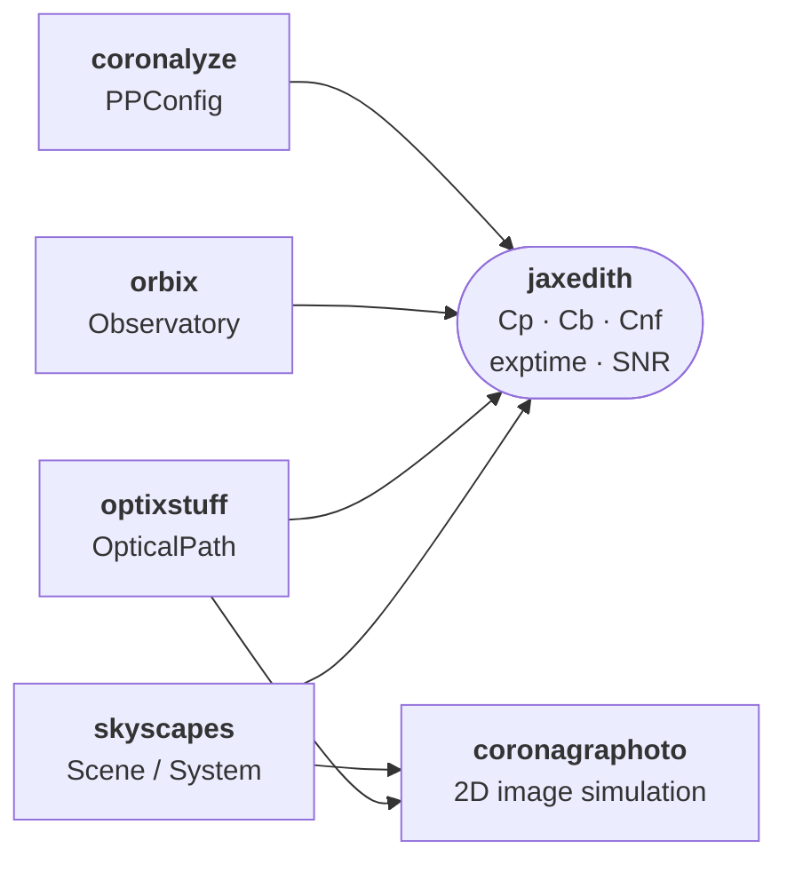

# jaxedith

JAX-native exposure time calculator for HWO direct imaging.

`jaxedith` returns scalar count rates, exposure times, and SNR
predictions from a coronagraph + scene + observation triple. It is
the fast inner loop for HWO yield calculations, sensitivity studies,
and retrievals where the ETC needs to be differentiable and JIT-able.

The library is a fully JAX-native port of the AYO /
[pyEDITH](https://github.com/eleonoraalei/pyEDITH/) heritage, with
EXOSIMS-detection and EXOSIMS-characterization variants exposed via
parallel function families.

## Where jaxedith sits in the stack



`jaxedith` is the scalar ETC counterpart to {mod}`coronagraphoto`'s
image simulator. Both consume the same {class}`skyscapes.System` +
{class}`optixstuff.OpticalPath`; `jaxedith` returns integrated count
rates and exposure times, `coronagraphoto` returns 2D detector
images.

## Quick start

System mode -- pass a {class}`skyscapes.System` directly. The
wrappers extract per-(planet, epoch) astrophysics and `jax.vmap` the
scalar core over `(K, T)`:

```python
import jax.numpy as jnp
import optixstuff as ox
from coronalyze import PPConfig
from jaxedith import exptime_from_system_ayo, zodi_fn_ayo
from orbix.observatory import Observatory, ObservatoryL2Halo

t_exp = exptime_from_system_ayo(
    system,                                # skyscapes.System
    optical_path,                          # optixstuff.OpticalPath
    observatory=Observatory(orbit=ObservatoryL2Halo.from_default()),
    exposure=ox.ExposureConfig(
        start_time_jd=jnp.array([2_460_000.5]),
        exposure_time_s=jnp.asarray(3600.0),
        central_wavelength_nm=jnp.asarray(500.0),
        bin_width_nm=jnp.asarray(20.0),
        position_angle_deg=jnp.asarray(0.0),
    ),
    ppconfig=PPConfig(ppfact=1.0, n_rolls=1, ez_ppf=jnp.inf),
    snr=7.0,
    zodi_fn=zodi_fn_ayo,
)
# t_exp shape (K, T): one exposure time per (planet, epoch)
```

Scalar mode -- supply your own astrophysical scalars via an
{class}`~jaxedith.ETCScene` dataclass. Useful for parameter sweeps,
sensitivity studies, and tests that do not need a full skyscapes
scene:

```python
from jaxedith import ETCScene, exptime_ayo

scene = ETCScene(
    F0=1.34e8,
    Fs_over_F0=0.005,
    Fp_over_Fs=1e-10,
    Fzodi=3.5e-10,
    Fexozodi=7.15e-9,
    dist_pc=10.0,
    sep_arcsec=0.1,
    Fbinary=0.0,
)

t_exp = exptime_ayo(
    optical_path, scene,
    wavelength_nm=500.0, separation_lod=5.0,
    dlambda_nm=100.0, snr=7.0,
)
```

For the EXOSIMS detection / characterization variants, swap
`_ayo` for `_exosims_det` or `_exosims_char` -- see
[ETC variants](explanation/variants).

## Where to read next

- [Architecture](explanation/architecture) -- the four-layer pipeline
  (`primitives → intermediates → etc → public`) and how to drop in
  at each layer.
- [ETC variants](explanation/variants) -- AYO vs EXOSIMS detection
  vs EXOSIMS characterization; which to use and what differs.

```{toctree}
:maxdepth: 1
:caption: Get started
:hidden:

installation
```

```{toctree}
:maxdepth: 1
:caption: Explanation
:hidden:

explanation/architecture
explanation/variants
```

```{toctree}
:maxdepth: 2
:caption: API Reference
:hidden:

autoapi/jaxedith/index
```
